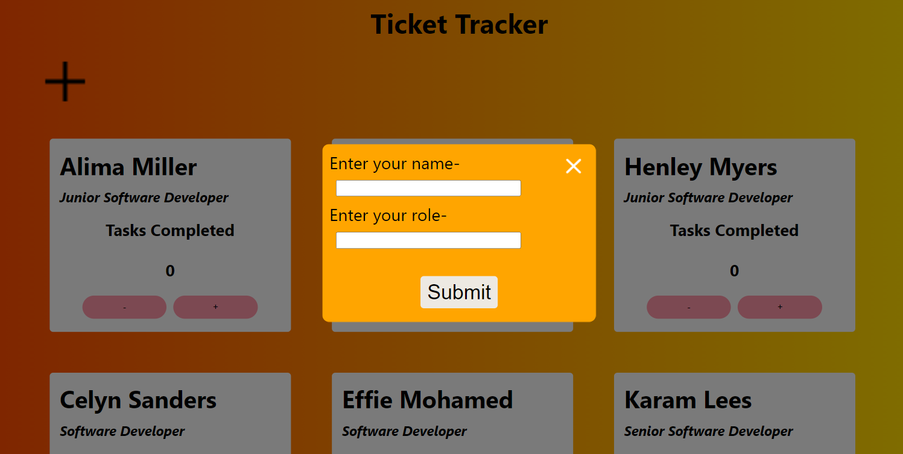
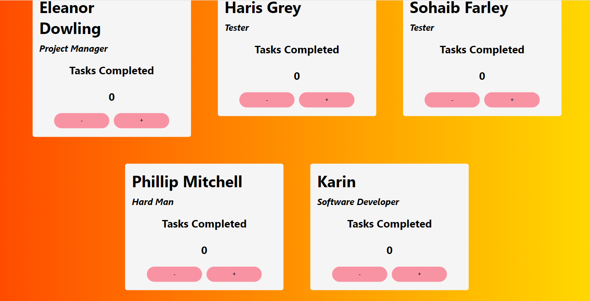

  

<h3 align="center">Ticket-Tracker</h3>

---

 An application built in React which allows employees to keep track of how many tickets they complete at work. The counter can increment and decrement (stopping at 0) the amount of tickets completed. New employees can be added using the form (accessed by clicking the plus button top left) and will appear in their own card at the bottom of the screen.
      

  

  

## 📝 Table of Contents

- [About](#about)
- [Usage](#usage)
- [Built Using](#built_using)
- [Authors](#authors)
- [Acknowledgments](#acknowledgement)

## 🧐 About 

This project was made to test my skills in React. 

Code of Note: 
- using states to manage the array of employees to update the cards displayed on the screen.
- pop-up modal form to input new employees

## 🎈 Usage 

Add employees by completing the form (accessed by toggling the plus sign). Use the increment/decrement buttons on each card to keep track of how many work tickets you have completed.

## ⛏️ Built Using 

- ReactJS
- HTML
- SCSS

## ✍️ Authors 

- [@karinhawk](https://github.com/karinhawk)

## 🎉 Acknowledgements 

- The _nology coaches!
